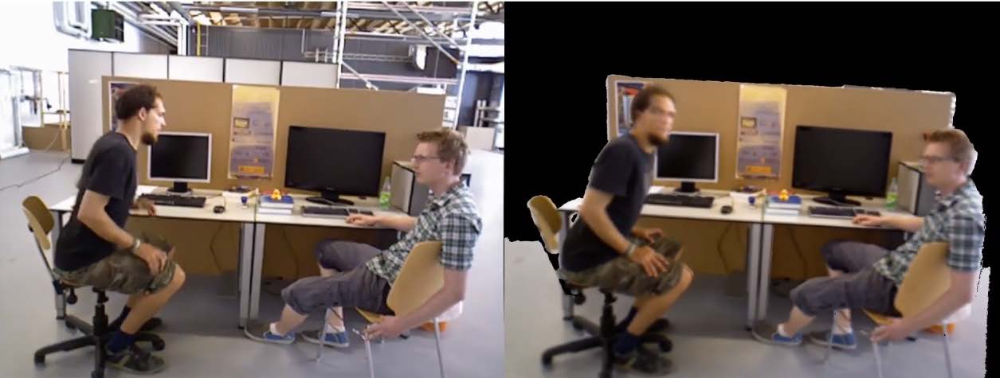

# 3D-Reconstruction-in-Dynamic-Environments
> Environment: 

Members: Bo Yue & Chi Zhang  
This is a project for our course AU332 -- Artificial Intelligence: Principles and Techniques. 

### Description
The majority of SLAM methods focus on static environments, but the deployment in real-world situations requires them to handle _dynamic_ objects.In this project, we are asked to implement an algorithm for a RGB-D sensor that is able to consistently map scenes containing multiple dynamic elements. For this project _a RGB-D sensor_ called Realsense will be provided.

### Related Information
- https://arxiv.org/abs/1905.02082[https://arxiv.org/abs/1905.02082]  
- https://www.youtube.com/watch?v=1P9ZfIS5-p4[https://www.youtube.com/watch?v=1P9ZfIS5-p4]
